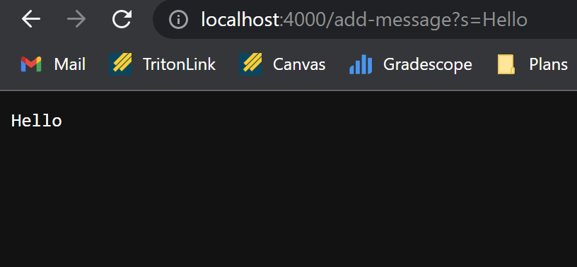
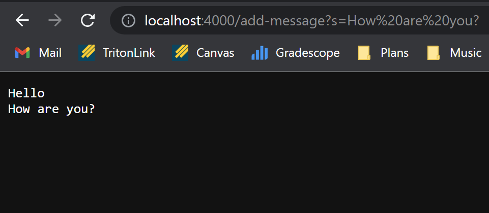
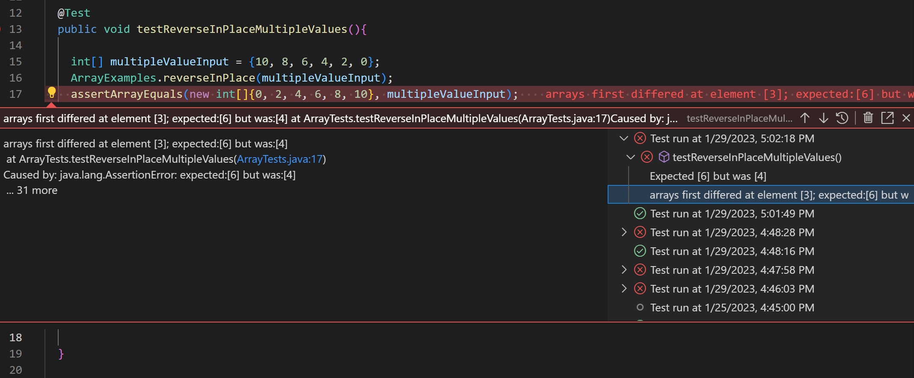
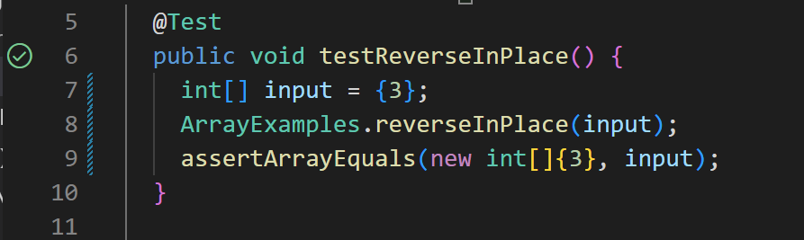

# Servers and Bugs
#### Written by: Ryan Seidl *(Wed. 3pm, B260)*
---
## *Part 1:* StringServer
For this part, I wrote a web server program called **StringServer** that displays a list of strings that the user is able to add through URL requests. **StringServer** uses the prewritten **Server.java** file from Lab 2 in order to host a web server.

Below is the code for the **StringServer** program:

```
  import java.io.IOException;
  import java.net.URI;
  import java.util.ArrayList;

class Handler implements URLHandler {

    ArrayList<String> stringList = new ArrayList<String>();

    public String handleRequest(URI url) {
        if (url.getPath().equals("/")) {

            String output = "";
            for(int i=0; i<stringList.size(); i++)
                output += stringList.get(i) + "\r\n";
            
            return output;

        }else {
            System.out.println("Path: " + url.getPath());
            if (url.getPath().contains("/add-message")) {
                String[] parameters = url.getQuery().split("=");
                if (parameters[0].equals("s")) {

                    stringList.add(parameters[1]);

                    String output = "";
                    for(int i=0; i<stringList.size(); i++)
                        output += stringList.get(i) + "\r\n";

                    return output;
                }
            }

            return "404 Not Found!";

        }
    }
}

class StringServer {
    public static void main(String[] args) throws IOException {
        if(args.length == 0){
            System.out.println("Missing port number! Try any number between 1024 to 49151");
            return;
        }

        int port = Integer.parseInt(args[0]);

        Server.start(port, new Handler());
    }
}
```

> `StringServer.java` consists of two classes: `StringServer` and `Handler`. The former of the two handles the creation of the web server, while the latter handles the function of the web server.

The following are two demos of `StringServer` as well as their corresponding explanations:


#### Example 1: `/add-message?s=Hello`
* The method called in this example is `handleRequest`.
* In this case, the relevant argument for the method is `/add-message?s=Hello`, which fulfills the parameter `URI url`. The relevant field of the class is `stringList`, which holds each string that the user inputs in the URL request. The value of `stringList` is now `Hello` because the method `handleRequest` added the String `Hello` to `stringList`.
* The field `stringList` changed from being empty to containing the String, `Hello`.


#### Example 2: `/add-message?s=How are you?`
* Similarly to example 1, the method called in this example is `handleRequest`.
* This time, the relevant argument for the method is `/add-message?s=How are you?`, which again fulfills the parameter `URI url`. The relevant field of the class is also `stringList`. This time, however, it contains `Hello` at index 0 and `How are you?` at index 1 because the method `handleRequest` added the String `How are you?` to `stringList`.
* The field `stringList` changed from containing only `Hello` to containing the two Strings, `Hello` and `How are you?`.

---
## *Part 2:* Bug Fixing
In this part, I will be analyzing a bug in the `reverseInPlace` method in `ArrayExamples.java`.

### **Failure-inducing Input:**
```
  @Test
  public void testReverseInPlaceMultipleValues(){

    int[] multipleValueInput = {10, 8, 6, 4, 2, 0};
    ArrayExamples.reverseInPlace(multipleValueInput);
    assertArrayEquals(new int[]{0, 2, 4, 6, 8, 10}, multipleValueInput);
    
  }
```

### **Working Input:**
```
  @Test
  public void testReverseInPlace(){

    int[] input = {3};
    ArrayExamples.reverseInPlace(input);
    assertArrayEquals(new int[]{3}, input);
    
  }
```

### **Symptom:**

Failure-inducing input:



Working input:



### **The Bug:**

Original code:

```
  static void reverseInPlace(int[] arr) {
  
    for(int i = 0; i < arr.length; i += 1) {
      arr[i] = arr[arr.length - i - 1];
    }
    
  }
```

Working code:

```
   static void reverseInPlace(int[] arr) {
    
    int[] tempArray = new int[arr.length];
    for(int j=0; j<arr.length; j++){

      int currentValue = arr[j];
      tempArray[j] = currentValue;

    }

    for(int i = 0; i < arr.length; i++) {
      arr[i] = tempArray[arr.length - i - 1];
    }
    
  }
```

The bug in `reverseInPlace` was that the for loop was overwriting the values of the initial array when attempting to reverse it. In order to fix this bug, I created a temporary array containing the values of the initial array. This allowed the for loop to copy items from the temporary array to the initial array in reverse order without overwriting any of the values.


---
## *Part 3:* What I Learned

During the lab in week 3, I learned how to use JUnit tests in order to test a program for bugs. Prior to this week, I was wondering why it was necessary to import the JUnit and Hamcrest libraries in Visual Studio Code, but now I recognize that these are required in order to utilize the aforementioned test methods. The week 3 lab activities demonstrated to me that JUnit tests are much more simple and structured ways of identifying and fixing bugs in a Java program in comparison to other methods such as printing to the console and manually trying to find where a program is failing.
