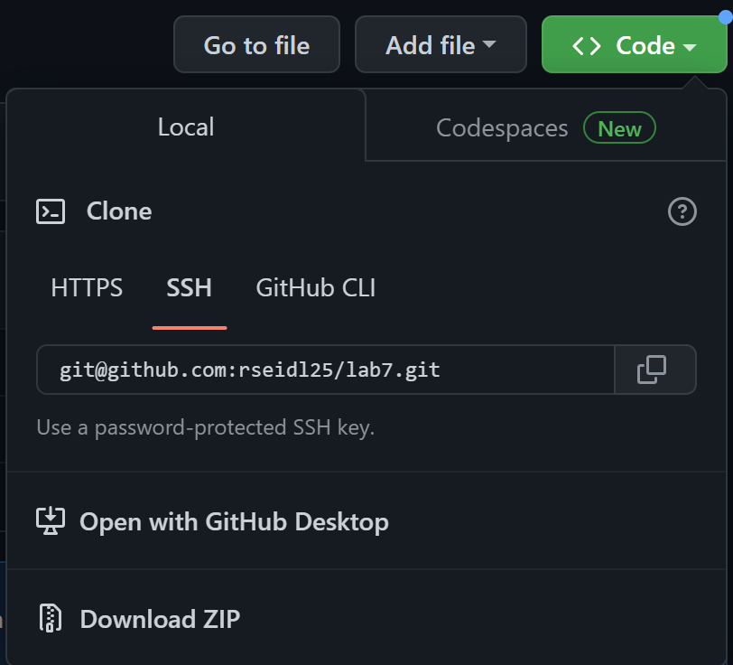

# CLDQ Comprehensive Tutorial
#### Written by: Ryan Seidl *(Wed. 3pm, B260)*
##### *NOTE: This tutorial will begin on Step 4, following when the user starts the timer.*
---
## *Step 4:* Log into ieng6

* To log into my ieng6, account I typed `ssh cs15lwi23adx@ieng6.ucsd.edu` followed by `<enter>` to run the command. Since I had previously set up an SSH Key for ieng6 on my machine, I wasn't prompted to type my ieng6 account password, but if you haven't set up an SSH Key then you will have to login using your password.

---
## *Step 5:* Clone your fork of the repository from your Github account

* I typed `https://github.com/rseidl25/lab7` into my web browser and 
pressed `<enter>` to enter the URL and access my repository.
* I clicked on the green `Code` button and then clicked `SSH` under the `Clone` option. Again, I had
previously set up an SSH Key for Github on my ieng6 account, so I'm able to clone using `SSH` instead of `HTTPS`.
* I copied the `SSH address` to my machine's clipboard by clicking the button with the two intersecting squares located directly beside the address. 

* Back in the terminal window, I typed `git clone ` then pressed `<ctrl-V>` to paste the `SSH address` from my
machine's clipboard and finally pressed `<enter>` to run the command. This created a clone of my fork of the Lab 7 repository in my ieng6 account.

---
## *Step 6:* Run the tests, demonstrating that they fail

* I typed `ls` then `<enter>` to find that the directory for the repository that I cloned is called `lab7`.

* To change my current directory to the newly cloned directory, I typed `cd l<tab>` to make the command line
`cd lab7/` then `<enter>` to run the command.

* To get the commands to compile and run the tests, I would need to reference the Week 3 lab instructions.
I typed `https://ucsd-cse15l-w23.github.io/week/week3/` into my browser and pressed `<enter>` to access this page.
* Under the `Table of Contents` on this page, I clicked the `Setup` link and scrolled down to the box labeled `Mac Users:`
containing the compile and run commands for the tests.
* In this box, I clicked and dragged with my mouse to highlight the compile command: 
`javac -cp .:lib/hamcrest-core-1.3.jar:lib/junit-4.13.2.jar *.java`. I then pressed `<ctrl-C>` to copy the command.
* In the terminal window, I pasted the compile command by pressing `<ctrl-V>` and then `<enter>` to run the command.
* Back in the `Mac Users:` box on the Week 3 lab instructions page, I clicked and dragged with my mouse to 
highlight the run command: `java -cp .:lib/hamcrest-core-1.3.jar:lib/junit-4.13.2.jar org.junit.runner.JUnitCore`. 
I again pressed `<ctrl-C>` to copy the command.
* I returned to the terminal window and pasted the run command by pressing `<ctrl-V>`. To specify which file to run, 
I pressed `<space>` and typed `L<tab>T<tab><backspace>` to make the command line 
`java -cp .:lib/hamcrest-core-1.3.jar:lib/junit-4.13.2.jar org.junit.runner.JUnitCore ListExamplesTests`.
* I pressed `<enter>` to run the command.

---
## *Step 7:* Edit the code file to fix the failing test

* To fix the failing test, I had to edit the `ListExamples.java` file by typing 
`nano L<tab>.j<tab>` followed by `<enter>` to run the command.

* The error in the code is found in the last `while` loop in the `merge` method. To navigate here, I typed
`<ctrl-w>while<enter><ctrl-w>while<enter><ctrl-w>while<enter>`. These commands allowed me to search for the string "while" until I got to the third while loop.
* The exact error is that `index1` in this loop needs to be `index2`. To get to this line, I typed 
`<down><down>` to move down 2 lines and to get to the character I needed to change, I typed 
* To fix the error, I pressed `<backspace>` and then typed `2`.
* I pressed `<ctrl-O><enter>` to save these changes and then pressed `<ctrl-X>` to exit `nano`.

---
## *Step 8:* Run the tests, demonstrating that they now succeed

* Since I had already ran the compile and run commands, I could run them through bash history instead of 
going through the entire process of copying and pasting them before. The compile command was 3 up in the 
bash history, so to access it I pressed `<up><up><up>` to move up 3 lines and `<enter>` to run the command.
* Likewise, the run command was now 3 up in the bash history, so to access it I pressed `<up><up><up>` to move up 3 lines and `<enter>` to run the command.

---
## *Step 9:* Commit and push the resulting change to your Github account

* To add the edited `ListExamples.java` file to the commit, I typed `git add L<tab>.j<tab>` to make 
the command line `git add ListExamples.java` and pressed `<enter>`.
* To commit the file, I typed `git commit -m Updated` and pressed `<enter>`. I wrote `Updated`, but you can use any commit message here.
* Now that the change was committed, I pushed it to my Github account by typing `git push origin` followed by `<enter>`.

---
