# CLDQ as a Bash Script
#### Written by: Ryan Seidl *(Wed. 3pm, B260)*
##### *NOTE: The script begins with Step 5, following when the user logs into ieng6.*
---
### What is a bash script and why is it useful for CLDQ?

A bash script is a text file that contains a series of terminal commands. It allows the user
to execute multiple commands at one time, rather than having to enter them into the terminal
one after another. In a situation like CLDQ where the user is tasked with completing multiple steps
in order to reach an overarching goal, a bash script saves lots of time because it prevents the 
user from having to enter every command from every step every time they want to do the entire process. 
Rather, they can enter each of these commands into the bash script once and only have to execute the 
script whenever they want to do the CLDQ challenge. It can take the user's time to complete the
challenge from over 3 minutes to under 5 seconds!

The following tutoial is structured similar to Lab Report 4, however this time the code from
each step (beginning with step 5) is added to a bash script. 

---
## *Step 4:* Log into ieng6
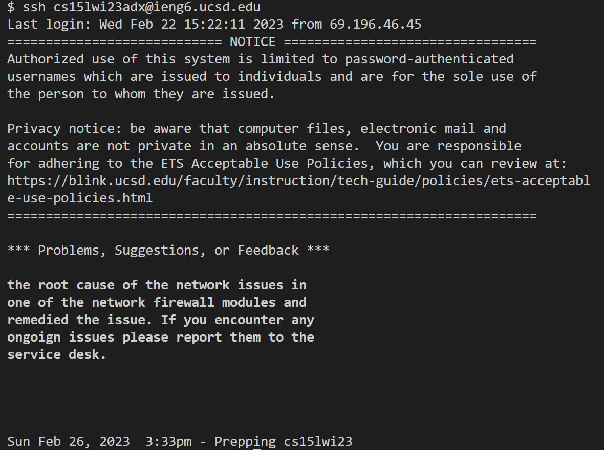
* To log into my ieng6, account I typed `ssh cs15lwi23adx@ieng6.ucsd.edu` followed by `<enter>` to run the command. Since I had previously set up an SSH Key for ieng6 on my machine, I wasn't prompted to type my ieng6 account password, but if you haven't set up an SSH Key then you will have to login using your password.

---
## *Step 4.5:* Create new bash script
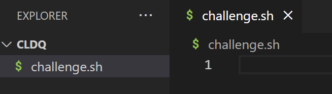
* To create the script, I navigated to the `EXPLORER` tab
on the left side of the VSCode window, pressed `<right-click>` on my mouse and clicked the
`New File` option. I typed `challenge.sh` and pressed `<enter>` to create the file. I then
double clicked on the newly-created `challenge.sh` file to begin the process of writing the script.

---
## *Step 5:* Clone your fork of the repository from your Github account
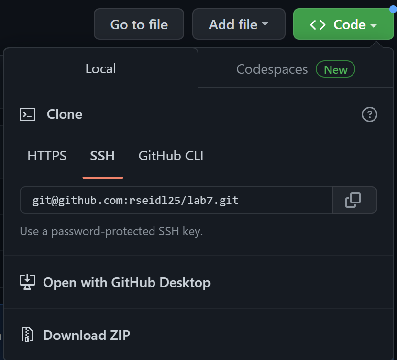

* I typed `https://github.com/rseidl25/lab7` into my web browser and 
pressed `<enter>` to enter the URL and access my repository.
* I clicked on the green `Code` button and then clicked `SSH` under the `Clone` option. Again, I had
previously set up an SSH Key for Github on my ieng6 account, so I'm able to clone using `SSH` instead of `HTTPS`.
* I copied the `SSH address` to my machine's clipboard by clicking the button with the two intersecting squares located directly beside the address. 

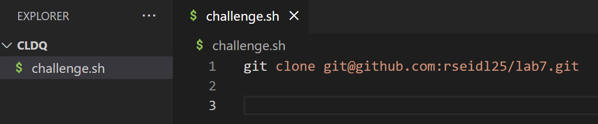

* Back in the `challenge.sh` editor window, I typed `git clone ` then pressed `<ctrl-V>` to paste the `SSH address` from my
machine's clipboard and finally pressed `<enter><enter><ctrl-S>` to go to a new line and save the file. This command will create a clone of my fork of the Lab 7 repository in my ieng6 account.

---
## *Step 6:* Run the tests, demonstrating that they fail
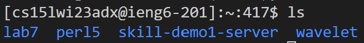

* I typed `ls` then `<enter>` to find that the directory for the repository that I cloned is called `lab7`.

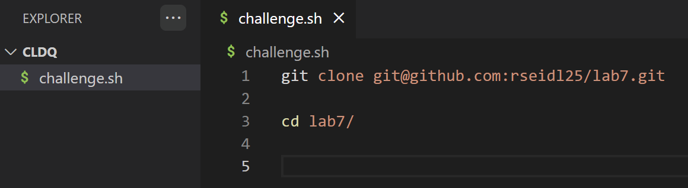

* To change the current directory to the newly cloned directory, I typed `cd lab7/` then `<enter><enter><ctrl-S>` to go to a new line and save the file.

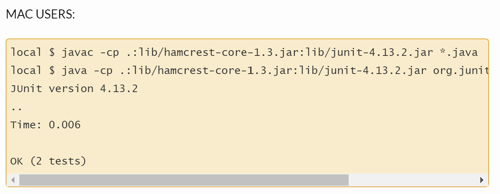

* To get the commands to compile and run the tests, I would need to reference the Week 3 lab instructions.
I typed `https://ucsd-cse15l-w23.github.io/week/week3/` into my browser and pressed `<enter>` to access this page.
* Under the `Table of Contents` on this page, I clicked the `Setup` link and scrolled down to the box labeled `Mac Users:`
containing the compile and run commands for the tests.
* In this box, I clicked and dragged with my mouse to highlight the compile command: 
`javac -cp .:lib/hamcrest-core-1.3.jar:lib/junit-4.13.2.jar *.java`. I then pressed `<ctrl-C>` to copy the command.
* In the `challenge.sh` editor window, I pasted the compile command by pressing `<ctrl-V>` and then `<enter><enter><ctrl-S>` to go to a new line and save the file.
* Back in the `Mac Users:` box on the Week 3 lab instructions page, I clicked and dragged with my mouse to 
highlight the run command: `java -cp .:lib/hamcrest-core-1.3.jar:lib/junit-4.13.2.jar org.junit.runner.JUnitCore`. 
I again pressed `<ctrl-C>` to copy the command.
* I returned to the `challenge.sh` editor window and pasted the run command by pressing `<ctrl-V>`. To specify which file to run, 
I pressed `<space>` and typed `ListExamplesTests`.
* I pressed `<enter><enter><ctrl-S>` to go to a new line and save the file.

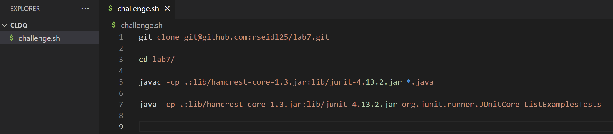

---
## *Step 7:* Edit the code file to fix the failing test

* The error in the code is found in the last `while` loop in the `merge` method. The `index1` in this loop needs to be `index2`.
* To fix the failing test, you have to edit the `ListExamples.java`. To do this via a bash script, you must use the `sed` command, which stands for stream editor. This command is mostly used for substituting text by first finding an inputted string and then replacing it.
* In the `challenge.sh` editor window, I typed `sed '43 s/index1/index2' ListExamples.java` followed by `<enter><enter><ctrl-S>` to go to a new line and save the file.
* NOTE: The `'n s/[1]/[2]'`option finds the occurence of the string `[1]` on `line n` and replaces it with the string `[2]`.

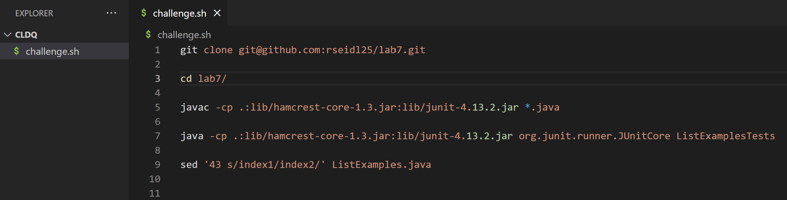

---
## *Step 8:* Run the tests, demonstrating that they now succeed

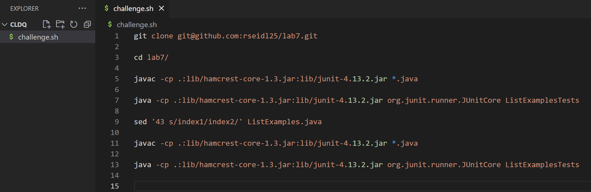

* Since I had copied the compile and run commands to `challenge.sh`, I could copy and paste them again.
* I clicked and dragged to highlight the commands on lines 5 and 7 of `challenge.sh` and pressed `<ctrl-C>` to copy them.
* I then clicked on line 11 of `challenge.sh` and pressed `<ctrl-V>` to paste the two commands into the script.
* I pressed `<enter><enter><ctrl-S>` to go to a new line and save the file.

---
## *Step 9:* Commit and push the resulting change to your Github account

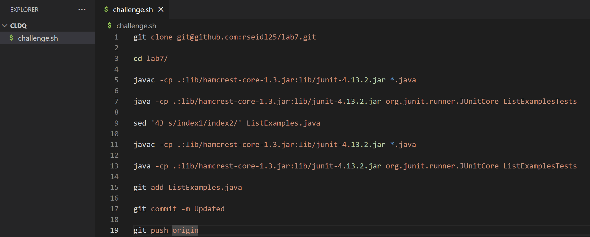

* To add the edited `ListExamples.java` file to the commit, I typed `git add ListExamples.java` in the `challenge.sh` editor window and pressed `<enter><enter><ctrl-S>` to go to a new line and save the file.
* To commit the file, I typed `git commit -m Updated` and pressed `<enter><enter><ctrl-C>` to go to a new line and save the file. I wrote `Updated`, but you can use any commit message here.
* After the change is committed, it'll need to be pushed to my Github account, so I typed `git push origin` followed by `<ctrl-S>` to save the file.

---
## Execute the bash script

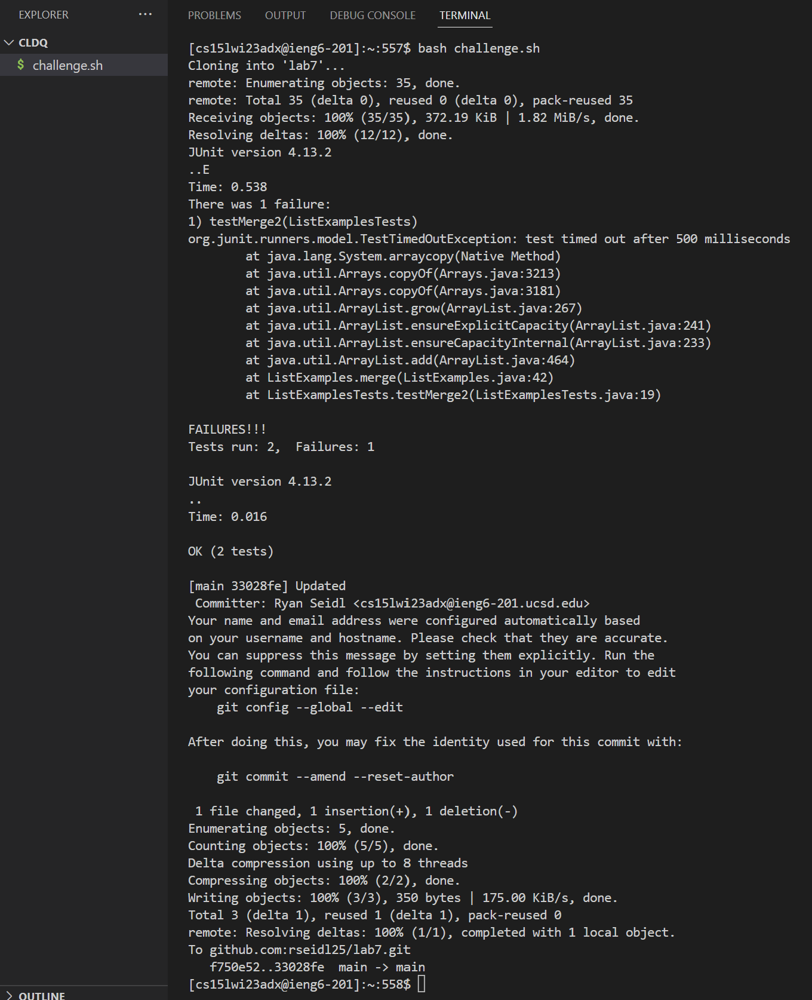

* In the terminal window logged into the `ieng6` account, I typed `bash challenge.sh`. This executed all commands successfully.

---
