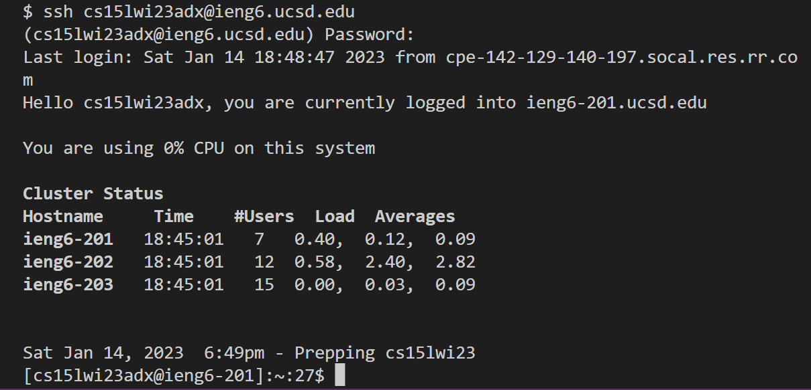

# Remote Access in CSE15L
#### Written by: Ryan Seidl *(Wed. 3pm, B260)*
---

 
## *Step 1:* Install Visual Studio Code
In order to remotely access the CSE15L server, you need to use a **terminal**, which can be found in Visual Studio Code (VScode).   

> Click [here](https://code.visualstudio.com/download) to download **VScode**. Make sure to select the download option for your correct operating system.

Follow the installer wizard and open up the VScode application. Your screen should look similar to this: 

#### *If you're running Windows:*
You'll need to install git to run bash commands in VScode. Click [here](https://gitforwindows.org/) to download git. After following the git installation wizard, follow [this](https://stackoverflow.com/questions/42606837/how-do-i-use-bash-on-windows-from-the-visual-studio-code-integrated-terminal/50527994#50527994) tutorial to configure git bash in VScode. After doing so, you may proceed to step 2.

#### *If you're on any OS besides Windows:*
You're now ready to run bash commands in the VScode terminal! Proceed to step 2. 

---

 
## *Step 2:* Remotely Connecting
First you must navigate to the VScode terminal. Find the VScode menu (top of the application window on Windows, top of the screen on Mac). Click the button that says "Terminal" and then select the "New Terminal" option. 

> The first command used in remotely connecting requires your CSE15L account information, which can be found by logging in [here](https://sdacs.ucsd.edu/~icc/index.php).

Type `ssh account@ieng6.ucsd.edu` into the terminal, replacing "account" with your CSE15L account. If it's your first time connecting you'll be prompted with a message as shown in the following image.

Simply type `yes` to authorize the connection to the server. The terminal will prompt you to enter your password. Type it in and press the "enter" key.

If your screen looks like the image above, you're now remotely connected to the computer in the CSE basement!

***NOTE:** If you input too many incorrect password attempts, you will be disconnected from the computer and will have to retry Step 2. Your screen will look like the following image:*

Once remotely connected to the computer, move on to Step 3.

---

 
## *Step 3:* Trying Some Commands
In this step, you'll run a few sample commands to familiarize youself with remote connection and basic bash terminal processes. Run the following commands in the order they're written:

* `pwd` "print working directory" - shows the current directory that you're accessing on the computer

> The image below demonstrates that the user's working directory is `home/linux/ieng6/cs15lwi23/cs15lwi23adx`.

* `cd` "change directory" - changes to a specific directory inputted after the command

> The image below shows that the user is switching directories to `/home/linux/ieng6/cs15lwi23`.

* `ls` "list" - shows the files contained in the current directory that's being accessed

> The image below shows all of the files in the `cs15lwi23` folder.

#### A list of other basic bash commands you can try can be found [here](https://www.educative.io/blog/bash-shell-command-cheat-sheet).

---

**This concludes the tutorial!** Type `exit` when you're ready to disconnect from the computer.
